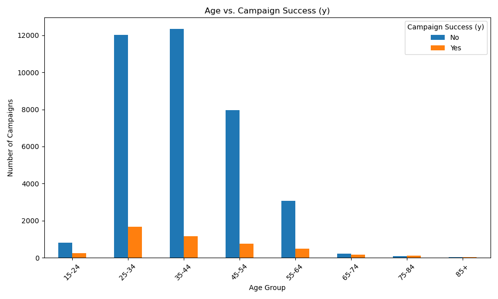

# Practical Application III: Comparing Classifiers

## Overview

This project focuses on comparing the performance of multiple machine learning classifiers for a bank marketing campaign dataset. The goal is to identify the most effective classification algorithm for predicting whether a client will subscribe to a term deposit, thereby improving the efficiency of directed marketing campaigns.

## Business Objective

**Increase efficiency of directed campaigns for long-term deposit subscriptions by reducing the number of contacts needed.**

By building an accurate predictive model, the bank can:
- Target customers most likely to subscribe to term deposits
- Reduce unnecessary marketing calls
- Optimize resource allocation for marketing campaigns
- Improve campaign success rates

## Dataset

The dataset comes from the UCI Machine Learning repository and contains data from a Portuguese banking institution. It represents **42 marketing campaigns** with the following characteristics:

- **Source**: UCI Machine Learning Repository - Bank Marketing Dataset
- **Size**: 41,188 records (41,174 after removing duplicates)
- **Features**: 20 input variables + 1 target variable
- **Target Variable**: Binary classification (yes/no) for term deposit subscription

### Feature Categories

#### Bank Client Data
- **Demographics**: age, job, marital status, education
- **Financial Status**: default, housing loan, personal loan

#### Campaign Contact Information
- **Communication**: contact type (cellular/telephone)
- **Timing**: month, day of week
- **Duration**: call duration in seconds (note: excluded from realistic models)

#### Campaign Context
- **Campaign Details**: number of contacts, previous campaign outcomes
- **Economic Indicators**: employment rate, consumer price index, confidence index, euribor rate, number of employees

## Data Preprocessing

### Data analysis using charts
#### Age vs. campaign success (y) 
- Most of the campaign succuess is around age group of 25-35 years

#### Campaigns per month
- Month of May and Jun shows better chances of winning the campaign

### Feature Engineering
1. **Categorical Encoding**: 
   - Education levels converted to numeric years (0-20)
   - Months converted to numeric (1-12)
   - Days of week converted to numeric (1-5)
   - Previous outcomes encoded as (0=failure, 1=nonexistent, 2=success)

2. **One-Hot Encoding**: Applied to categorical variables:
   - Job categories (12 job types)
   - Marital status (married, single, divorced)
   - Default, housing, and loan status
   - Contact type

3. **Data Cleaning**:
   - Removed unknown values for education (replaced with mean)
   - Dropped duplicate records
   - Excluded 'unknown' categories from one-hot encoding

### Final Feature Set
- **Total Features**: 30 (after encoding)
- **Data Types**: 5 float64, 5 int64, 5 int8, 16 boolean
- **Memory Usage**: 4.0 MB

## Model Comparison

### Baseline Performance
- **Majority Class Accuracy**: 88.73% (predicting 'no' for all cases)
- **Target**: Beat this baseline with machine learning models

### Models Evaluated

#### 1. Logistic Regression
- **Train Accuracy**: 90.96%
- **Test Accuracy**: 90.60%
- **Performance**: Good generalization, slight overfitting

#### 2. K-Nearest Neighbors (KNN)
- **Default Parameters**: n_neighbors=5, weights='uniform'
- **Performance**: Evaluated through hyperparameter tuning

#### 3. Decision Trees
- **Default Parameters**: max_depth=None, min_samples_split=2
- **Performance**: Evaluated through hyperparameter tuning

#### 4. Support Vector Machines (SVM)
- **Default Parameters**: C=1.0, kernel='rbf', gamma='scale'
- **Performance**: Evaluated through hyperparameter tuning

## Hyperparameter Tuning

### Grid Search Parameters

#### Logistic Regression
- **C**: [0.01, 0.1, 1, 10]
- **Penalty**: ['l1'] (Lasso regularization)
- **Solver**: ['liblinear', 'saga']
- **Max Iterations**: [5000]

#### K-Nearest Neighbors
- **n_neighbors**: [3, 5, 7]
- **weights**: ['uniform', 'distance']

#### Decision Trees
- **max_depth**: [3, 5, None]
- **min_samples_split**: [2, 5]
- **criterion**: ['entropy']

#### Support Vector Machines
- **C**: [0.1, 1, 10, 100]
- **kernel**: ['linear', 'rbf', 'poly']
- **gamma**: ['scale', 'auto']

### Cross-Validation
- **CV Folds**: 3
- **Scoring Metrics**: accuracy, precision, recall, F1-score
- **Refit Strategy**: Optimize for precision

## Key Findings

1. **Data Quality**: The dataset is well-structured with no missing values, making it suitable for machine learning applications.

2. **Feature Importance**: 
   - Duration is noted as highly predictive but should be excluded for realistic deployment
   - Economic indicators provide valuable context for campaign timing
   - Client demographics and financial status are key predictors

3. **Model Performance**: Logistic Regression shows strong performance with good generalization, suggesting it may be suitable for production use.

4. **Business Impact**: The models can significantly improve campaign efficiency by identifying high-probability customers, potentially reducing unnecessary contacts by targeting the right audience.

## Files

- **`practical_application_III.ipynb`**: Main Jupyter notebook containing the complete analysis
- **`data/`**: Directory containing the bank marketing dataset
- **`README.md`**: This documentation file

## Before and After Hyperparameter Tuning

| model                   | train time | train score | test score | precision  | recall    |
|------------------------|-----------|------------|-----------|------------|-----------|
| LogisticRegression      | 11.011696 | 0.910805   | 0.908197  | 0.646758   | 0.408405  |
| KNeighborsClassifier    | 0.797259  | 0.932967   | 0.900425  | 0.565693   | 0.501078  |
| DecisionTreeClassifier  | 0.102202  | 1.0        | 0.887189  | 0.499485   | 0.522629  |
| SVC                     | 11.150062 | 0.898327   | 0.895932  | 0.612698   | 0.207974  |

| model                  | accuracy | precision | recall | best_params                                   |
|------------------------|---------------------|-----------------------|-------------------|-----------------------------------------------|
| LogisticRegression      | 0.9106              | 0.8006                | 0.6885            | {'C': 0.1, 'max_iter': 5000, 'penalty': 'l1', ...} |
| KNeighborsClassifier    | 0.9075              | 0.7744                | 0.7253            | {'n_neighbors': 7, 'weights': 'uniform'}     |
| DecisionTreeClassifier  | 0.9124              | 0.7909                | 0.7345            | {'criterion': 'entropy', 'max_depth': 5, 'min_...} |

## Future Improvements

1. **Feature Selection**: Implement automated feature selection methods
2. **Ensemble Methods**: Explore Random Forest and Gradient Boosting
3. **Advanced Preprocessing**: Apply scaling/normalization for better SVM performance
4. **Business Metrics**: Incorporate cost-benefit analysis for false positives/negatives

